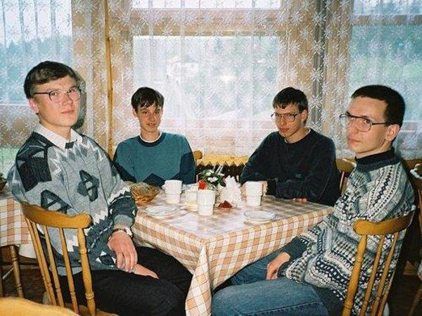

# La culture c'est pas de la confiture

Rejoignez-nous

# Kerlandrier

_Le Kerlandrier est un site affiche. Il a vocation à **agréger** et **mettre à disposition** les événements sur le territoire de la CCA (et plus si affinités)._
_Ce dépôt stocke du code utile pour un administrateur du projet. Ce sont essentiellement des aides à la mise à jour du contenu du projet Kerlandrier._

* * *

Le [Kerlandrier](https://kerlandrier.cc/) utilise un [calendrier Openagenda](https://openagenda.com/fr/flux-cca-test) et son [api](https://developers.openagenda.com/00-structure-evenement/) pour générer son contenu à chaque ouverture de la page.

## Contexte

La **mise à disposition** des événements se veut _numérique_ et _physique_. _Numérique_ via la [page web statique du Kerlandrier](https://hentou.cc/tsts/convivialites/).
_Physique_ via un usage Web2Print qui permet d'imprimer le contenu sur un format papier (A5, A4, A4, A0 pour les plus ambitieux).

L'**agrégation** des événements est l'obstacle principal à la réussite du projet.

### Freins à l'agrégation

*   Sources d'informations multiples:
    + Affichage papier
    + Newsletter de lieux et d'associations
    + Evénements et posts Facebbok
    + Sites Web
    + Bouche à oreille/ Discussions Whatsapp
*   Blocages techniques à l'automatisation:
    + Blocage par Facebook du scrap d'infos sur son contenu
    + Incompatibilités des formats de calendrier ouverts, Google, Apple, ...
    + Pas de solution simple, open source, trouvée pour faire ce travail
*   Temps de contribution manuel
    + [La flemme](https://yewtu.be/watch?v=ZdHupyZIfK0)

## Contribuer

Le projet dit oui à votre assistance si vous :

*   Êtes au courant de tous les bons plans du territoire,
*   Collez des affiches à vos heures perdues.
*   Parcourez les internets pour en extraire des pépites
*   Remplissez l'[Openagenda](https://openagenda.com/kerlandrier/contribute),
*   Faites de la spéculation sur le marché du nom de domaine pour inonder les internets de Kerlandrier,
*   Possédez un agenda type Google Agenda que vous pouvez rendre public.,

## Remerciements

*   Le Jockey
*   La Hacking Hut®
*   L'[api oa](https://developers.openagenda.com/00-structure-evenement/)
*   Ce [Google sheet](https://docs.google.com/spreadsheets/d/1Z1x7kJPdJWx5ha9R72SIihwreVV7sF7CnuVIjlArTTE/edit?gid=2108004383#gid=2108004383)
*   Ce [Figma](https://www.figma.com/design/lWl3pg0mMPVUMK55Z3VGPh/Kerlandrier?node-id=1-6&node-type=FRAME&t=xRVzEoVvrHjPotYx-0)
*   Cette [merveille](https://programmedesexpos.paris/) & cette [merveille](https://leretroprojecteur.com/)
*   Cette [extension](https://chromewebstore.google.com/detail/instant-data-scraper/ofaokhiedipichpaobibbnahnkdoiiah) rustique mais diablement efficace

## Licence

_TO DO_